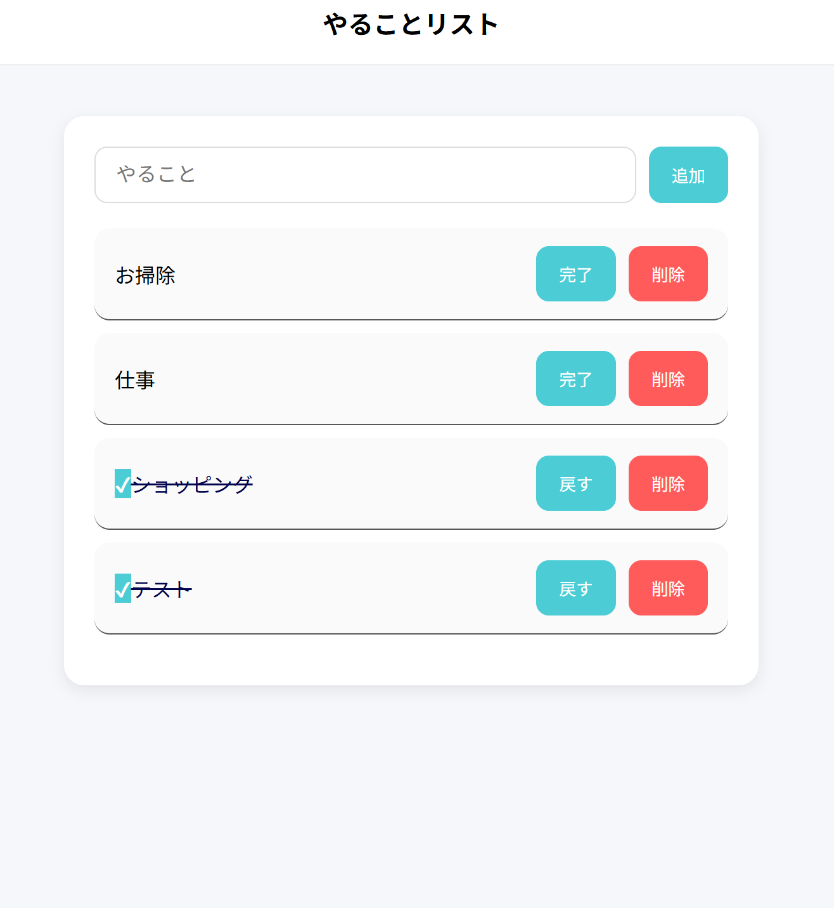

# TypeScript Todo Application

シンプルなTodo管理アプリケーション。
TypeScriptを用いて、UI操作・状態管理・データ永続化を意識した構成で実装しています。

ロジックと画面操作を分離し、保守性・可読性を意識した設計を行いました。

---

## Features

* Todo追加
* Todo削除
* Todo完了状態切り替え
* Enterキーによる追加操作
* LocalStorageによるデータ永続化
* 完了済みタスクの自動ソート

---

## Tech Stack

| Category   | Technology   |
| ---------- | ------------ |
| Language   | TypeScript   |
| Build Tool | Vite         |
| UI         | HTML / CSS   |
| Storage    | LocalStorage |

---

## Architecture

TypeScriptで作成したシンプルなTodoアプリです。
Todoの追加・完了・削除機能に加えて、LocalStorageを利用したデータ保存にも対応しています。

---

# アプリ概要

このアプリでは以下の機能を実装しています。

* Todo追加
* Todo削除
* Todo完了切り替え
* Enterキー追加対応
* LocalStorage保存
* 完了済みTodoの並び替え

---

# 🛠 使用技術

| 技術           | 内容               |
| ------------ | ---------------- |
| TypeScript   | 型安全なJavaScript開発 |
| Vite         | フロントエンド開発環境      |
| HTML         | 画面作成             |
| CSS          | スタイリング           |
| LocalStorage | データ保存            |

---

# 📂 ディレクトリ構成

```txt
src/
 ├── main.ts
 ├── TodoApp.ts
 ├── Todo.ts
 └── style.css
```

---

#  設計について

役割ごとにファイルを分割しています。

| ファイル       | 役割          |
| ---------- | ----------- |
| main.ts    | 画面操作・イベント処理 |
| TodoApp.ts | Todo管理ロジック  |
| Todo.ts    | Todo型定義     |

---

#  主な実装内容

## ✅ Todo追加

入力欄に文字を入力し、追加ボタンまたはEnterキーでTodoを追加できます。

```ts
app.addTodo(input.value)
```

---

## ✅ Todo完了切り替え

完了ボタンを押すことで状態を切り替えています。

```ts
todo.completed = !todo.completed
```

---

## ✅ Todo削除

削除ボタンでTodoを配列から除外しています。

```ts
this.todos = this.todos.filter(todo => todo.id !== id)
```

---

## ✅ LocalStorage保存

ブラウザを更新してもTodoが消えないように保存しています。

```ts
localStorage.setItem(
  "todos",
  JSON.stringify(this.todos)
)
```

---

# 処理の流れ

```txt
ユーザー入力
   ↓
追加ボタンクリック
   ↓
TodoApp.addTodo()
   ↓
配列へ追加
   ↓
LocalStorage保存
   ↓
render()
   ↓
画面更新
```

---

# クラス図

```txt
┌─────────────────────┐
│      TodoApp        │
├─────────────────────┤
│ - todos: Todo[]     │
├─────────────────────┤
│ + addTodo()         │
│ + getTodos()        │
│ + toggleTodo()      │
│ + deleteTodo()      │
│ - save()            │
└─────────────────────┘
          │
          ▼
┌─────────────────────┐
│        Todo         │
├─────────────────────┤
│ id: number          │
│ title: string       │
│ completed: boolean  │
└─────────────────────┘
```

---

#  工夫したポイント

* UIとロジックを分離して保守しやすくした
* TypeScriptで型安全に実装した
* LocalStorageでデータ永続化を実装した
* completed状態で自動ソートを行った

---

# 学んだこと

このアプリ制作を通して以下を学習しました。

* TypeScriptの型定義
* クラス設計
* 配列操作（map/filter/find/sort）
* DOM操作
* LocalStorage
* イベント処理

---

# 今後追加したい機能

* Todo編集機能
* フィルター機能
* ダークモード
* React化
* Firebase連携

---

# 起動方法

```bash
npm install
npm run dev
```

---

## Screenshot



---
